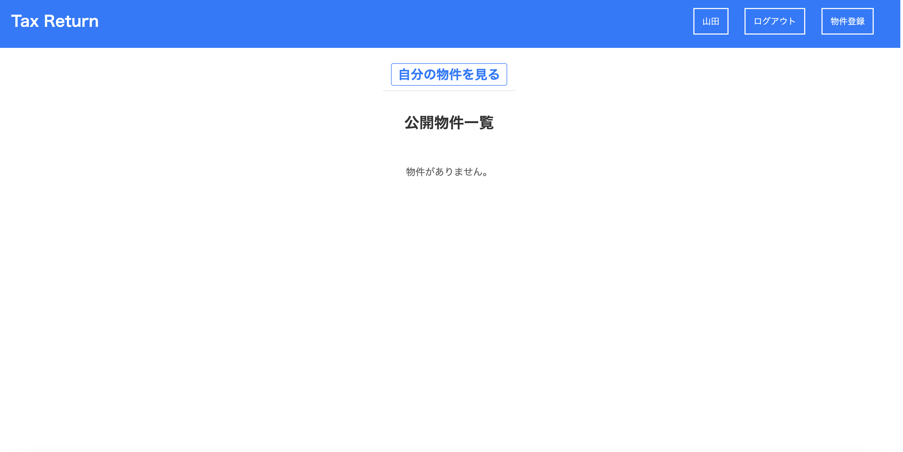
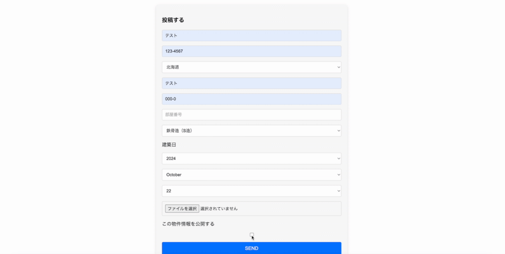
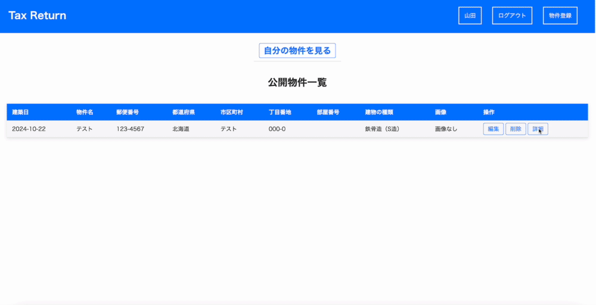

## アプリ概要

  このアプリは小規模個人不動産経営者向けの物件管理アプリです
  主な機能は物件の損益管理で、収入と支出を年・月毎に管理し収支状況を把握しやすくするタモのものです。
  また、物件の売却を希望している場合は物件情報を公開することもできます。

## 操作画面

  トップページ
  

-------------------------------------------

  物件登録画面
  

  ※最後にチェックすることで物件情報が公開される

-------------------------------------------

  経費入力画面
  

  収入入力画面
  

  物件詳細画面から収支の入力欄に行ける

--------------------------------------------

  収支表
  

  入力された年のページが生成され、収支欄に表示される。未入力の場合は0で表示される。

## usersテーブル

| Column              | Type       | Options                        |
| ------------------- | ---------- | ------------------------------ |
| email               | string     | null: false, unique: true      |
| encrypted_password  | string     | null: false                    |
| user_name           | string     | null: false                    |

### Association
- has_many :properties

## propertiesテーブル

| Column            | Type       | Options                        |
| ----------------- | ---------- | ------------------------------ |
| construction_date | date       | null: false                     |
| name              | string     | null: false                     |
| postal_code       | string     | null: false                     |
| prefecture_id     | integer    | null: false, foreign_key: true  |
| city              | string     | null: false                     |
| street_number     | string     | null: false                     |
| room_number       | string     |                                |
| building_type_id  | integer    | null: false                |
| user_id           | references | null: false, foreign_key: true  |

### Association
- belongs_to :user
- has_one :income
- has_one :expense

## incomeテーブル

| Column         | Type       | Options                         |
| -------------- | ---------- | ------------------------------  |
| rent           | integer    | |
| key_money      | integer    | |
| other_income   | integer    | |
| property_id    | references | null: false, foreign_key: true  |

### Association
- belongs_to :property

## expensesテーブル

| Column              | Type       | Options                        |
| ------------------- | ---------- | ------------------------------ |
| taxes               | integer    |              |
| loan_interest_rate  | integer    |              |
| management_fee      | integer    |              |
| brokerage           | integer    |              |
| advertising         | integer    |              |
| premium             | integer    |              |
| depreciation        | integer    |              |
| repair_cost         | integer    |              |
| other_expenses      | integer    |              |
| property_id         | references | null: false, foreign_key: true |

### Association
- belongs_to :property